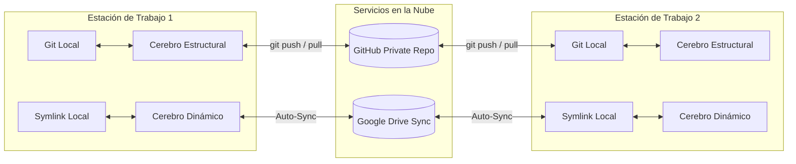

# Especificación Técnica de Arquitectura Dual (Google Antigravity)

Este documento describe en detalle la arquitectura de sincronización dividida (**Dual Brain Architecture**) implementada en Google Antigravity para entornos multi-dispositivo y desarrollo asistido por IA.

---

## 1. Motivación y Problema Resolutivo

Al trabajar con sistemas agenticos avanzados y modelos de contexto amplio (ej. Gemini 1.5 Pro / 3.6 Flash / Pro en Google Antigravity):
1. **Contaminación del Contexto:** Almacenar logs de conversación, fragmentos temporales y artefactos dentro del repositorio de código provoca ruido constante en los índices de código y consumo excesivo de tokens.
2. **Conflictos de Git:** Múltiples máquinas sincronizando historiales de chat locales generan constantes conflictos de merge (`git merge conflicts`).
3. **Consumo Eficiente de Suscripción:** Al sincronizar el estado dinámico vía almacenamiento en nube (Google Drive), las sesiones se reanudan entre PCs sin duplicar búsquedas complejas o peticiones a la API.

---

## 2. Los Dos Pilares de la Arquitectura

### 🧠 A. Cerebro Estructural (Git / GitHub)
* **Propósito:** Mantener la lógica determinista, las reglas de negocio, los agentes, las habilidades y el código ejecutable.
* **Control de Versiones:** Git estricto con commits descriptivos y atómicos.
* **Ruta de Repositorio:** `https://github.com/MarcoFou/my_antigravity_brain.git`
* **Elementos Contenidos:**
  - Código fuente del proyecto (`src/`, `lib/`, `scripts/`).
  - Definición de Habilidades (`SKILL.md`) y Agentes (`agents/`).
  - Prompts base y archivos de sistema (`INSTRUCCION_GLOBAL.md`).
  - Configuraciones del proyecto (`package.json`, `pyproject.toml`, etc.).

### ⚡ B. Cerebro Dinámico (Google Drive & Windows Symlinks)
* **Propósito:** Persistir el estado conversacional, memoria a corto y mediano plazo, artefactos de sesión y archivos temporales.
* **Mecanismo de Enlace:** Enlace simbólico de directorio (`SymbolicLink`) apuntando a la carpeta sincronizada por Google Drive para escritorio.
* **Ruta Predeterminada en Antigravity:**  
  `C:\Users\<USER>\.gemini\antigravity\brain\<WORKSPACE_ID>`
* **Ruta Destino en Google Drive:**  
  `G:\Mi unidad\AntigravityBrain\<WORKSPACE_ID>` (o equivalente según el perfil).
* **Elementos Contenidos:**
  - Artefactos dinámicos (`implementation_plan.md`, `walkthrough.md`, `scratch/`).
  - Logs de ejecución y trascripción conversacional (`transcript.jsonl`).
  - Cachés de ejecución y bases de datos temporales (SQLite, vector caches, etc.).

---

## 3. Matriz de Decisiones de Almacenamiento

| Tipo de Archivo / Recurso | Destino Correcto | ¿Pasa por Git? |
| :--- | :--- | :--- |
| Código de aplicación (`*.js`, `*.py`, `*.cs`, `*.html`) | Cerebro Estructural | **SÍ** |
| Archivos `SKILL.md` y definiciones de herramientas | Cerebro Estructural | **SÍ** |
| Documentación del proyecto (`README.md`, `ARCHITECTURE.md`) | Cerebro Estructural | **SÍ** |
| `implementation_plan.md` y `walkthrough.md` | Cerebro Dinámico (Drive) | **NO** |
| Scratchpad (`brain/<id>/scratch/*`) | Cerebro Dinámico (Drive) | **NO** |
| Logs de comandos y transcripts de la sesión | Cerebro Dinámico (Drive) | **NO** |
| Archivos de entorno con secretos (`.env`) | Ninguno (Usar `.env.example`) | **NO** |

---

## 4. Estrategia de Portabilidad Multi-PC

Para evitar romper enlaces entre diferentes usuarios o letras de unidad de Windows (`C:\Users\F1995` vs `C:\Users\OtroUsuario`):

1. **Variables de Entorno y Rutas Relativas:**  
   Todo script de build o automatización dentro del repositorio de Git debe utilizar `%USERPROFILE%` o variables de entorno relativas al proyecto.
2. **Estructura Estándar del Enlace Simbólico:**
   En cada PC de desarrollo se creará un enlace simbólico que apunte desde la carpeta local de Antigravity (`%USERPROFILE%\.gemini\antigravity\brain\<WORKSPACE_ID>`) a la carpeta compartida en Google Drive.

---

## 5. Mantenimiento y Buenas Prácticas

- **Frecuencia de Sync Git:** Ejecutar `git pull` al iniciar la jornada en un nuevo PC y `git push` al finalizar modificaciones estructurales.
- **Limpieza de Caché:** El Cerebro Dinámico se sincroniza automáticamente en background mediante Google Drive Client. No requiere commits manuales.
- **Monitoreo de `.gitignore`:** Asegurarse de que ningún submódulo cree directorios de log dentro de la ruta rastreada por Git.
