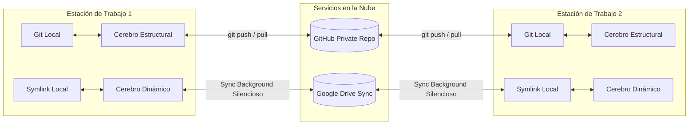

# Especificación Técnica de Arquitectura Dual (Google Antigravity)

Este documento describe la especificación técnica de la arquitectura de sincronización dividida (**Dual Brain Architecture**) implementada en Google Antigravity para entornos multi-dispositivo.

---

## 1. Motivación y Racional de Sincronización

### ¿Por qué dos canales de sincronización distintos?

1. **GitHub es para Hitos Estáticos:**  
   Git y GitHub están optimizados para guardar versiones estables y revisiones atómicas del código fuente y las reglas de negocio. No fueron diseñados para procesar mutaciones por segundo generadas por registros de chat o artefactos de memoria de IA.

2. **Google Drive es para el "Trabajo Sucio" Dinámico:**  
   Google Drive opera con sincronización silenciosa y continua en segundo plano. Esto permite que los historiales de chat, archivos temporales de sesión (`scratch/`) y artefactos de memoria conversacional persistan instantáneamente entre la PC Principal y otras máquinas, **sin requerir commits manuales ni provocar conflictos de fusión (`merge conflicts`)**.

3. **Prevención de Contaminación de Contexto:**  
   Al aislar el estado conversacional en Google Drive, los índices del proyecto en Git permanecen limpios y centrados únicamente en el código funcional, reduciendo el consumo de tokens y evitando respuestas imprecisas del modelo.

---

## 2. Los Dos Pilares de la Arquitectura

### 🧠 A. Cerebro Estructural (Git / GitHub)
* **Propósito:** Mantener la lógica determinista, las reglas de negocio, los agentes, las habilidades y el código ejecutable.
* **Control de Versiones:** Git estricto con commits descriptivos y manuales para hitos funcionales.
* **Ruta de Repositorio:** `https://github.com/MarcoFou/my_antigravity_brain.git`

### ⚡ B. Cerebro Dinámico (Google Drive & Windows Symlinks)
* **Propósito:** Persistir el estado conversacional, memoria a corto y mediano plazo, artefactos de sesión y archivos temporales.
* **Mecanismo de Enlace:** Enlace simbólico de directorio (`SymbolicLink`) apuntando a la carpeta sincronizada por Google Drive para escritorio.
* **Ruta Predeterminada en Antigravity:**  
  `C:\Users\<USER>\.gemini\antigravity\brain\<WORKSPACE_ID>`

---

## 3. Matriz de Decisiones de Almacenamiento

| Tipo de Archivo / Recurso | Destino Correcto | Mecanismo de Sync |
| :--- | :--- | :--- |
| Código de aplicación (`*.js`, `*.py`, `*.cs`, `*.html`) | Cerebro Estructural | Commit manual en Git |
| Archivos `SKILL.md` y definiciones de agentes | Cerebro Estructural | Commit manual en Git |
| Documentación del proyecto (`README.md`, `ARCHITECTURE.md`) | Cerebro Estructural | Commit manual en Git |
| Historiales de chat (`*.transcript.jsonl`) | Cerebro Dinámico | Auto-Sync Google Drive |
| Planes y Walkthroughs (`implementation_plan.md`) | Cerebro Dinámico | Auto-Sync Google Drive |
| Scratchpad (`brain/<id>/scratch/*`) | Cerebro Dinámico | Auto-Sync Google Drive |

---

## 4. Estrategia Multi-PC y Lenguaje

- **Rutas Relativas:** Todo script o configuración dentro del repositorio Git debe emplear `%USERPROFILE%` o variables de entorno relativas.
- **Idioma Oficial:** Toda la documentación, respuestas y comentarios en código deben generarse en **Español**.
