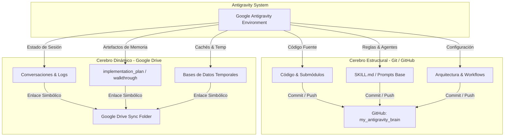

# Google Antigravity - Arquitectura Dual (Cerebro Estructural & Dinámico)

[](https://github.com/MarcoFou/my_antigravity_brain.git)
[](https://github.com/MarcoFou/my_antigravity_brain.git)
[](#)

Repositorio central y privado para la arquitectura, sincronización y directivas de los agentes de **Google Antigravity**. 

---

## 📌 Propósito del Sistema

El entorno de trabajo opera bajo una **Arquitectura de Sincronización Dividida (Dual Brain Architecture)** diseñada para:
1. **Prevenir la contaminación del contexto** en las sesiones de trabajo con IA.
2. **Optimizar el consumo de cuota** de la suscripción Google AI Plus / Gemini.
3. **Garantizar la coherencia y portabilidad muti-PC** (desarrollo transparente entre múltiples computadoras).
4. **Separar código determinista de memoria dinámica** evitando commits accidentales de logs, estados de sesión o cachés.

---

## 🏗️ Visión General de la Arquitectura Dual



---

## 📂 Separación Estricta de Responsabilidades

| Dimensión | Cerebro Estructural (Git / GitHub) | Cerebro Dinámico (Google Drive) |
| :--- | :--- | :--- |
| **Tecnología** | Git Repository (`my_antigravity_brain`) | Google Drive + Windows Symlinks (`mklink /D`) |
| **Ubicación Física** | Local Repo (Clonado) | `C:\Users\<USER>\.gemini\antigravity\brain\<WORKSPACE_ID>` |
| **Contenido** | • Código fuente de proyectos (`urban_flow`, etc.)<br>• Reglas de agentes y habilidades (`SKILL.md`)<br>• Prompts del sistema y configuraciones global<br>• Archivos `.gitignore` estructurados | • Historiales de conversación y logs<br>• Artefactos de sesión (`implementation_plan.md`, `walkthrough.md`)<br>• Archivos de memoria temporal, cachés de runtime |
| **Criterio de Exclusión** | Nunca subir archivos de estado o temporales. | No versionar código fuente determinista. |

---

## 💻 Parámetros del Workspace Activo

* **Workspace ID Principal:** `427f9d73-6715-470c-a8e5-f8fb11a2d5a1`
* **Ruta de Cerebro Dinámico (PC Principal):**  
  `C:\Users\F1995\.gemini\antigravity\brain\427f9d73-6715-470c-a8e5-f8fb11a2d5a1`
* **Ruta de Repositorio Estructural:**  
  `https://github.com/MarcoFou/my_antigravity_brain.git`

---

## 📑 Documentación Detallada

Para una comprensión profunda y la configuración rápida de nuevos equipos, consulta la siguiente documentación:

* 📐 **[ARCHITECTURE.md](./ARCHITECTURE.md)**: Especificación técnica detallada de la arquitectura dual, flujos de datos y diseño del enlace simbólico.
* 🤖 **[AGENTS_GUIDE.md](./AGENTS_GUIDE.md)**: Instrucción global y directivas obligatorias para los agentes de Inteligencia Artificial.
* 🖥️ **[SETUP_MULTI_PC.md](./SETUP_MULTI_PC.md)**: Guía paso a paso y script automatizado PowerShell (`setup_dual_brain.ps1`) para desplegar esta arquitectura en una PC nueva.
* 📋 **[templates/](./templates/)**: Plantillas reutilizables para `.gitignore` y comandos de inicio de sesión.

---

## ⚡ Guía Rápida de Despliegue en Nueva PC

1. **Clonar este repositorio:**
   ```powershell
   git clone https://github.com/MarcoFou/my_antigravity_brain.git
   cd my_antigravity_brain
   ```

2. **Ejecutar el script de enlace simbólico (PowerShell Administrador):**
   ```powershell
   .\setup_dual_brain.ps1 -DrivePath "G:\Mi unidad\AntigravityBrain"
   ```

3. **Iniciar Antigravity y Cargar la Instrucción Global:**  
   Proporcionar al agente el contenido de [`templates/INSTRUCCION_GLOBAL.md`](./templates/INSTRUCCION_GLOBAL.md) al iniciar un nuevo workspace o hilo de trabajo.

---

*Desarrollado y mantenido bajo el estándar Google Antigravity Dual Architecture.*
