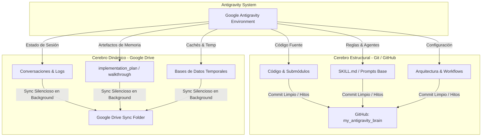

# Google Antigravity - Arquitectura Dual (Cerebro Estructural & Dinámico)

Repositorio central y privado para la arquitectura, sincronización y directivas de los agentes de **Google Antigravity**. 

---

## 💡 El Porqué de la Arquitectura (Racional de Sincronización)

El sistema comprende la naturaleza distinta de los archivos para optimizar los flujos de trabajo y evitar ruido:

1. **GitHub (Cerebro Estructural):** Se utiliza *únicamente* para versionar hitos de desarrollo estático (código, reglas, arquitecturas y habilidades). Git no está diseñado para mutaciones constantes por segundo.
2. **Google Drive (Cerebro Dinámico):** Sincronización silenciosa en segundo plano. Se encarga del "trabajo sucio" de mantener vivos los historiales de chat, cachés y el contexto temporal entre las diferentes PCs sin requerir commits manuales ni generar conflictos de fusión (`merge conflicts`).

> [!CAUTION]
> **PROHIBICIÓN ESTRICTA:** Bajo ninguna circunstancia el agente o desarrollador debe hacer commit (`git add`/`git commit`) sobre historiales de chat, logs o archivos temporales de sesión.

---

## 🏗️ Visión General de la Arquitectura Dual

---

## 📂 Separación Estricta de Responsabilidades

| Dimensión | Cerebro Estructural (Git / GitHub) | Cerebro Dinámico (Google Drive) |
| :--- | :--- | :--- |
| **Tecnología** | Git Repository (`my_antigravity_brain`) | Google Drive + Windows Symlinks (`mklink /D`) |
| **Ubicación Física** | Local Repo (Clonado) | `C:\Users\<USER>\.gemini\antigravity\brain\<WORKSPACE_ID>` |
| **Contenido** | • Código fuente de proyectos (`urban_flow`, etc.) • Reglas de agentes y habilidades (`SKILL.md`) • Prompts del sistema y configuraciones globales • Archivos `.gitignore` estructurados | • Historiales de conversación y logs • Artefactos de sesión (`implementation_plan.md`, `walkthrough.md`) • Archivos de memoria temporal, cachés de runtime |
| **Criterio de Exclusión** | Solo hitos de desarrollo estático. | Sincronización automática de datos mutables. |

---

## 💻 Parámetros del Workspace Activo

* **Workspace ID Principal:** `427f9d73-6715-470c-a8e5-f8fb11a2d5a1`
* **Ruta de Cerebro Dinámico (PC Principal):**  
  `C:\Users\F1995\.gemini\antigravity\brain\427f9d73-6715-470c-a8e5-f8fb11a2d5a1`
* **Ruta de Repositorio Estructural:**  
  `https://github.com/MarcoFou/my_antigravity_brain.git`
* **Idioma Oficial de Operación:** Español (`es-ES` / `es-MX`).

---

## 📑 Documentación Detallada

* 📐 **[ARCHITECTURE.md](./ARCHITECTURE.md)**: Especificación técnica detallada de la arquitectura dual, flujos de datos y diseño del enlace simbólico.
* 🤖 **[MULTI_PC_AGENT_INSTRUCTIONS.md](./MULTI_PC_AGENT_INSTRUCTIONS.md)**: **Protocolo determinista para agentes de IA** para diagnosticar y sincronizar conversaciones y proyectos en PCs secundarias.
* 🔄 **[MANUAL_SYNC_GUIDE.md](./MANUAL_SYNC_GUIDE.md)**: Instrucciones paso a paso del uso del sistema, flujo de `git pull` y `git push` manual, y resolución de conflictos.
* 🤖 **[AGENTS_GUIDE.md](./AGENTS_GUIDE.md)**: Instrucción global y directivas obligatorias para los agentes de Inteligencia Artificial.
* 🖥️ **[SETUP_MULTI_PC.md](./SETUP_MULTI_PC.md)**: Guía paso a paso y script automatizado PowerShell (`setup_dual_brain.ps1`) para desplegar esta arquitectura en una PC nueva.
* 📋 **[templates/](./templates/)**: Plantillas reutilizables para `.gitignore` y la instrucción global del sistema.

---

*Desarrollado y mantenido bajo el estándar Google Antigravity Dual Architecture.*
